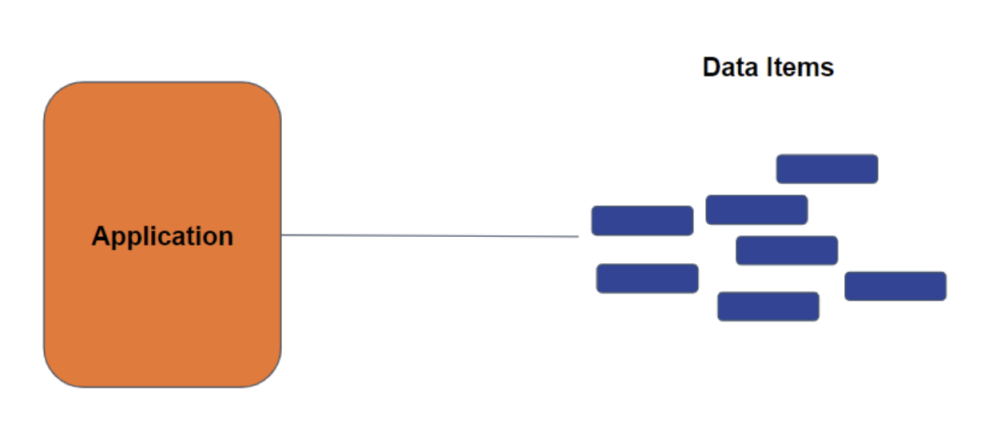
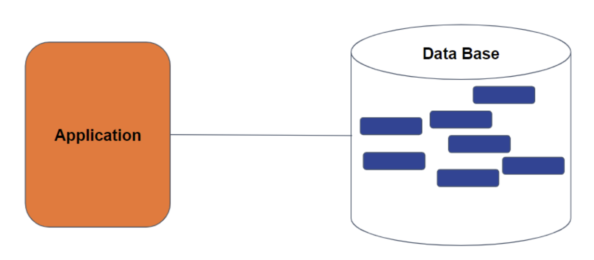
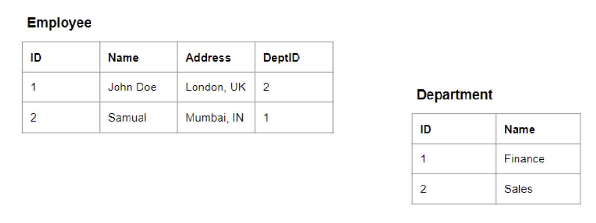
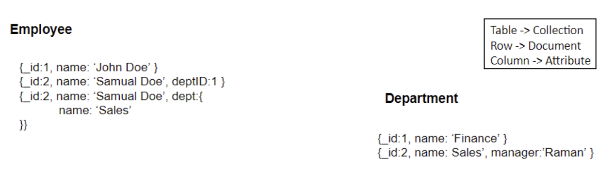
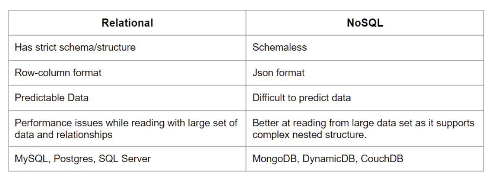

## GETTING STARTED WITH DATABASE

## Understanding Data
### Data in Applications

- Data in applications refers to the information the application utilizes to function
correctly.
- In an e-commerce backend application, examples of data include users,
products, cart items, and orders.
- Applications like Facebook, Twitter, and WhatsApp also handle various types
of data, such as user data, posts, comments, pictures, videos, etc.

### Importance of Data Management
- Data is the main asset of any application, and without it, the application is
rendered useless.
- Currently, the application uses in-memory storage, leading to data loss upon
server restarts.
- To avoid data loss, a persistent storage solution is required.

### Need for Persistent Storage
1. Persistent storage ensures that data remains intact even after the server
restarts.
2. Persistent storage prevents data loss and maintains the application's
functionality and usability.
3. File systems can provide persistent storage but may need to be more efficient
for handling complex data operations.
4. Persistent storage stands as a foundational pillar in data management,
guaranteeing the preservation of data integrity even in the face of server
restarts or system failures. This resilient storage approach is pivotal in
averting data loss, ensuring uninterrupted application functionality, and
sustaining the usability of vital information.

### Challenges with File Systems
- While file systems offer persistent storage, they are not optimised for data
manipulation operations.
- Managing data with file systems can become difficult for applications with
large amounts of data (e.g., Facebook, Google, LinkedIn).

### Introduction to Databases
- Databases are tools that provide persistent storage and enable efficient data
manipulation operations.
- A database allows users to effectively create, read, update, and delete data
(CRUD operations).
- Retrieving data from databases efficiently is crucial for populating user profiles
or timelines.

### Significance of Databases
- Applications like Facebook heavily rely on databases as their primary tool for
managing and storing data.
- Losing user data for such companies would mean losing their entire wealth
and value.

## Understanding Databases
A database is a software tool that stores and manages data for applications.
Applications communicate with databases to store, retrieve, and perform operations
on data. Different types of databases exist, depending on the nature of the
application's data.

### Relational Databases

1. Relational databases store data in tabular format (rows and columns), similar
to spreadsheets.
2. Data is structured with a defined schema, specifying the columns and their
data types.
3. Primary keys (unique identifiers) and foreign keys establish relationships
between tables.
4. Relationships allow data from different tables to be linked and related to each
other.
5. Relational databases are suited for applications with structured and
predictable data.

### NoSQL Databases

1. NoSQL databases are schemaless, allowing flexibility in storing unstructured
or unpredictable data.
2. Data is stored in JSON-like format, allowing nested structures within
documents.
4. NoSQL databases are ideal for applications with varying and unpredictable
data attributes.
4. They offer more straightforward and efficient data retrieval, especially for
nested data.

### Differences between Relational and NoSQL Databases

### Popular Database Types
- Popular relational databases include MySQL, PostgreSQL, and SQL Server.
- Popular NoSQL databases include MongoDB, DynamoDB, and CosDB.
- Cloud platforms like AWS and Azure also offer databases as a service.

#### Characteristics that make each of these databases popular choices.
Popular relational databases like MySQL, PostgreSQL, and SQL Server are favored
for their structured data model, ACID compliance, and strong consistency, making
them ideal for applications requiring strict data integrity.

In contrast, MongoDB, DynamoDB, and CosDB are prominent NoSQL databases
celebrated for their flexibility, scalability, and ability to handle unstructured or
semi-structured data efficiently, catering to modern applications' diverse data
requirements.

Cloud platforms such as AWS and Azure further provide managed database
services, streamlining deployment and management tasks for various database
systems.
